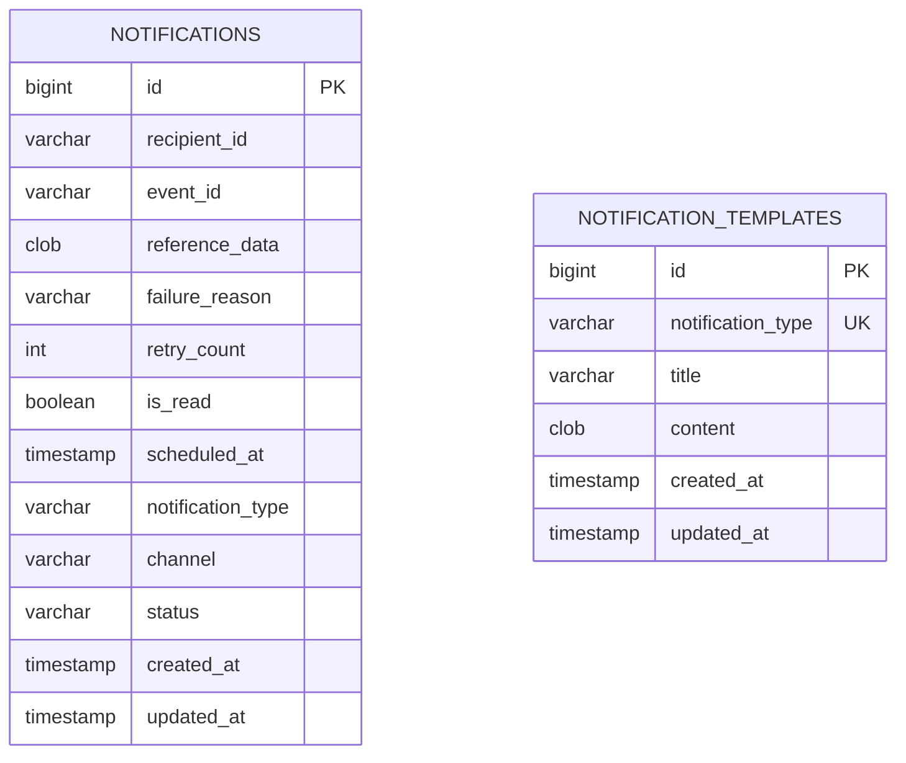

# alimtalk

이벤트 기반 알림(이메일 / 인앱) 발송 서비스. 수강신청 완료, 결제 확정, 강의 시작 임박, 수강 취소 등 이벤트 발생 시 알림 발송을 요청받아, API 요청 스레드와 분리된 워커가 비동기로 실제 발송을 처리한다.

과제 원문 요구사항은 [docs/REQUIREMENTS.md](docs/REQUIREMENTS.md) 참고.

## 프로젝트 개요

- 클라이언트가 알림 발송을 "요청"하면 즉시 접수 응답(202)만 주고, 실제 발송은 DB 폴링 기반 워커가 비동기로 처리한다.
- 알림 상태(대기/처리중/성공/최종실패)를 관리하며, 실패 시 자동 재시도 후 최종 실패로 보관한다.
- 동일 이벤트(eventId) + 채널 조합에 대한 중복 발송을 DB 유니크 제약으로 막는다.
- 실제 메시지 브로커 없이 DB 폴링으로 큐를 대체하되, 나중에 브로커로 교체 가능한 구조(폴링 부분만 컨슈머로 교체)로 설계했다.
- 부가 기능으로 발송 스케줄링, 타입별 메시지 템플릿, 읽음 처리, 최종 실패 보관/수동 재시도를 구현했다.

## 기술 스택

| 영역 | 사용 기술 |
|---|---|
| 언어/런타임 | Java 17 |
| 프레임워크 | Spring Boot 4.1.1 (Spring Web MVC, Spring Data JPA, Validation) |
| ORM | Hibernate 7.4.5 |
| DB | H2 (in-memory 모드) |
| 직렬화 | Jackson 3 (`tools.jackson`) |
| 빌드 | Gradle 9.7.1 (wrapper 포함) |
| 기타 | Lombok |
| 테스트 | JUnit 5, spring-boot-starter-test |

## 실행 방법

### 로컬 실행

사전 요구사항: JDK 17

```bash
# Windows
gradlew.bat bootRun

# macOS / Linux
./gradlew bootRun
```

- 기본 포트: `8080`
- H2 콘솔: `http://localhost:8080/h2-console` (JDBC URL: `jdbc:h2:mem:alimtalk`, user: `sa`, password: 없음)
- in-memory DB라 별도 파일이 생기지 않고, clone 후 별도 설정 없이 바로 실행해볼 수 있다. 대신 재시작하면 데이터가 전부 초기화된다(`spring.jpa.hibernate.ddl-auto=create-drop`) — 재시작 생존을 실제로 시연하려면 file 모드로 바꿔야 한다(아래 "운영 시나리오" 참고).
- 운영자 전용 API(`/api/notification-templates/**`)는 `X-Admin-Key` 헤더가 필요하다. 기본값은 `da049c7249f0eef6d161cdbe6614499d`(로컬 개발용)이며, 배포 시 환경변수 `ADMIN_API_KEY`로 덮어써야 한다.

```bash
ADMIN_API_KEY=my-secret-key ./gradlew bootRun
```

## API 목록 및 예시

모든 응답은 `{ "code": "...", "message": "...", "data": ... }` 형태의 공통 응답(`ApiResponse`)으로 내려간다.

### 알림 발송 요청 등록

```
POST /api/notifications
Content-Type: application/json
```

```json
{
  "recipientId": "user-123",
  "notificationType": "ENROLLMENT_COMPLETED",
  "eventId": "evt-2026-08-31-001",
  "referenceData": { "courseId": "course-1", "courseName": "스프링 기초" },
  "channel": "IN_APP",
  "scheduledAt": null
}
```

`scheduledAt`은 선택 필드다. 비우면 즉시 발송 대상으로 등록되고, 미래 시각을 넣으면 그 시각 이후에만 워커가 집어간다.

응답 (`202 Accepted`):

```json
{
  "code": "S001",
  "message": "알림 발송 요청이 접수되었습니다.",
  "data": { "notificationId": 1, "scheduledAt": "2026-08-31T10:17:44.553642" }
}
```

같은 `eventId` + `channel`로 다시 요청하면 `409 Conflict` (`N001`)로 거절된다.

### 알림 상태 조회

```
GET /api/notifications/{notificationId}
```

```json
{
  "code": "S002",
  "message": "알림 상태 조회에 성공했습니다.",
  "data": {
    "notificationId": 1,
    "recipientId": "user-123",
    "notificationType": "ENROLLMENT_COMPLETED",
    "channel": "IN_APP",
    "status": "SUCCESS",
    "statusDescription": "발송 성공",
    "failureReason": null,
    "retryCount": 0,
    "read": false,
    "scheduledAt": "2026-08-31T10:17:44.553642",
    "createdAt": "2026-08-31T10:17:44.553642",
    "updatedAt": "2026-08-31T10:17:44.923335"
  }
}
```

### 사용자 알림 목록 조회

```
GET /api/notifications?recipientId=user-123&read=false&page=0&size=20
```

`read` 파라미터는 생략 가능(생략 시 전체). 응답은 `NotificationSummaryResponse`의 페이지(`code: S003`).

### 최종 실패 알림 목록 조회 (선택 구현, 운영자 전용)

```
GET /api/notifications/failed
X-Admin-Key: da049c7249f0eef6d161cdbe6614499d
```

`status = FAILED_FINAL`인 알림만 페이지로 조회한다(`code: S006`). 운영자가 "최종 실패 보관함"을 확인하는 용도라 `X-Admin-Key` 헤더가 필요하다. 없거나 틀리면 `401 Unauthorized` (`E004`).

### 읽음 처리 (선택 구현)

```
PATCH /api/notifications/{notificationId}/read
```

응답: `code: S004`. 여러 기기에서 동시에 호출해도 안전하다(아래 "설계 결정과 이유" 참고).

### 수동 재시도 (선택 구현, 운영자 전용)

```
POST /api/notifications/{notificationId}/retry
X-Admin-Key: da049c7249f0eef6d161cdbe6614499d
```

`FAILED_FINAL` 상태인 알림만 재시도 가능. 그 외 상태면 `409 Conflict` (`N003`). 운영자 수동 재시도이므로 `X-Admin-Key` 헤더가 필요하다. 없거나 틀리면 `401 Unauthorized` (`E004`).

### 알림 템플릿 관리 (선택 구현, 운영자 전용)

`X-Admin-Key` 헤더 필요. 없거나 틀리면 `401 Unauthorized` (`E004`).

```
PUT /api/notification-templates/{notificationType}
Content-Type: application/json
X-Admin-Key: da049c7249f0eef6d161cdbe6614499d
```

```json
{
  "title": "수강신청 완료",
  "content": "{{recipientId}}님, 수강신청이 완료되었습니다."
}
```

있으면 수정, 없으면 생성(upsert). `content`/`title`의 `{{key}}`는 발송 시 `recipientId`와 `referenceData`의 키로 치환된다.

```
GET /api/notification-templates/{notificationType}
X-Admin-Key: da049c7249f0eef6d161cdbe6614499d
```

타입에 등록된 템플릿이 없으면 `404` (`N004`). 이 경우 발송 자체는 막히지 않고, 알림 타입 설명 문구가 기본 메시지로 쓰인다.

### 공통 에러 응답 예시

```json
{
  "code": "E001",
  "message": "요청 값이 올바르지 않습니다.",
  "data": [
    { "field": "channel", "rejectedValue": "SMS", "reason": "허용되지 않는 값입니다. 가능한 값: [EMAIL, IN_APP]" }
  ]
}
```

## 데이터 모델 설명



두 테이블은 FK로 묶여있지 않다 — `notification_type`은 둘 다 같은 자바 enum(`NotificationType`) 값을 쓰는 애플리케이션 레벨 매칭이고, DB 제약으로 강제하진 않는다(템플릿이 없어도 발송이 막히면 안 되기 때문).

- **`notifications`**: 알림 발송 요청/처리 상태를 담는 핵심 테이블. `(event_id, channel)`에 유니크 제약이 걸려있어 이게 곧 중복 발송 방지 키다.
- **`notification_templates`**: 알림 타입별 메시지 템플릿. `notification_type`에 유니크 제약이 걸려있어 타입당 1개만 존재한다.

**주요 enum**

| enum | 값 |
|---|---|
| `NotificationStatus` | `PENDING`(대기) → `PROCESSING`(처리중) → `SUCCESS`(성공) / `FAILED_FINAL`(최종실패) |
| `NotificationType` | `ENROLLMENT_COMPLETED`, `PAYMENT_CONFIRMED`, `LECTURE_STARTING_SOON`, `ENROLLMENT_CANCELLED` |
| `NotificationChannel` | `EMAIL`, `IN_APP` |

## 요구사항 해석 및 가정

- **중복 발송 방지 키를 `(eventId, channel)`로 잡음**: "동일 이벤트 중복 발송 금지"를 "같은 이벤트를 같은 채널로 두 번 보내면 안 된다"로 해석했다. 같은 이벤트를 EMAIL과 IN_APP 둘 다로 보내는 멀티채널 팬아웃은 정상 시나리오로 간주해 허용한다.
- **`scheduledAt` 미지정 시 즉시 발송 대상**: "즉시 발송 아님(비동기 접수)"과 "발송 예약(선택 구현)"을 같은 필드로 통합했다. `scheduledAt`이 없으면 등록 시각을 기준으로 워커가 바로 집어간다.
- **재시도 시 백오프 없음**: 실패하면 바로 `PENDING`으로 되돌려 다음 폴링 주기(2초)에 즉시 재시도한다. 별도 지수 백오프는 두지 않았다(아래 "설계 결정과 이유" 참고).
- **수동 재시도 시 `retryCount`를 0으로 초기화**: 초기화하지 않으면 이미 최대 재시도 횟수에 도달한 상태라, 재시도 1회 실패만으로 다시 즉시 `FAILED_FINAL`이 되어 "재시도"가 무의미해지기 때문이다.
- **템플릿 관리는 운영자 전용, 회원은 접근 불가**: 알림 문구는 운영 정책 영역이라고 해석해 별도 API 키 인증을 앞단에 걸었다. 실제 로그인/회원 인증 체계는 이 서비스 범위 밖으로 뒀다.
- **"실제 운영 환경으로 전환 가능한 구조"를 브로커 교체 지점과 다중 인스턴스 안전성 두 가지로 해석**: `NotificationWorker`(폴링해서 후보 id 뽑는 부분)만 컨슈머로 바뀌면 되고, `NotificationDispatchService`/`NotificationSender`는 그대로 재사용 가능한 구조로 짰다.

## 설계 결정과 이유

### 알림 상태 전이

```
PENDING --(claim 성공)--> PROCESSING --(발송 성공)--> SUCCESS
PROCESSING --(발송 실패, retryCount < max)--> PENDING (즉시 재시도 대상)
PROCESSING --(발송 실패, retryCount >= max)--> FAILED_FINAL
FAILED_FINAL --(운영자 수동 재시도)--> PENDING (retryCount 0으로 초기화)
```

`PROCESSING`이 `STUCK_THRESHOLD`(1분) 이상 머물러 있으면(워커가 죽는 등) 다음 폴링에서 다시 `PENDING`처럼 claim 대상으로 회수된다.

### claim 기반 중복 처리 방지 (동시 요청 + 다중 인스턴스)

- 등록 시점 중복은 `(event_id, channel)` DB 유니크 제약 + `DataIntegrityViolationException` 캐치로 막는다. 동시에 같은 요청이 두 번 들어와도 하나만 성공하고 나머지는 `409`로 거절된다.
- 실제 발송(워커) 시점 중복은 원자적 조건부 UPDATE(`claim`)로 막는다. `WHERE status = PENDING OR (status = PROCESSING AND stuck)` 조건의 UPDATE가 영향을 준 row 수가 1이면 이 인스턴스가 소유권을 획득한 것이고, 0이면 다른 워커(다른 인스턴스 포함)가 이미 가져간 것이다. DB row-lock에 기대는 방식이라 별도의 분산 락 없이도 다중 인스턴스 환경에서 안전하다.

### 비동기 처리 구조 — 브로커 없는 폴링 + 전환 가능 설계

- `NotificationWorker`가 `@Scheduled(fixedDelay = 2000)`로 2초마다 폴링한다. API 요청 스레드(컨트롤러)는 등록만 하고 즉시 리턴하므로 발송 처리와 완전히 분리돼 있다.
- claim에 성공한 건은 `NotificationDispatchService.processClaimed()`가 처리한다. 외부 API 호출(`sender.send()`)은 트랜잭션 밖에서 실행하고, 결과 반영(`NotificationStateService`)만 짧은 트랜잭션으로 커밋한다 — 외부 호출을 트랜잭션 안에 두면 응답 대기 동안 DB 커넥션을 계속 잡고 있어 커넥션 풀 고갈로 번질 수 있기 때문이다.
- `processClaimed()`는 `@Async`(전용 bounded 스레드풀, `AsyncConfig` 참고)로 배치(최대 50건) 내에서 병렬 처리한다. 처음엔 순차처리로도 요구사항(4번)이 충족된다고 보고 `@Async`를 뺐었는데, 배치사이즈·stuck threshold 근거를 다시 따져보니 순차처리 자체가 문제였다 — 아래 "운영 파라미터 근거" 참고.
- 실제 브로커(Kafka/SQS 등)로 전환 시 `NotificationWorker`(후보 id를 뽑는 폴링 부분)만 컨슈머로 교체하면 되고, `NotificationClaimService`/`NotificationDispatchService`/`NotificationSender`는 그대로 재사용 가능하다.

### 운영 파라미터 근거 — 배치사이즈 / stuck threshold / 재시도 횟수

과제 원문에 트래픽·SLA 수치가 없어서, 아래 상수들은 실측이 아니라 명시적 가정 위에서 도출했다.

- **가정**: 실제 발송 API(이메일/카카오 알림톡 등)의 최대 타임아웃을 3초로 잡는다(실측치 아님 — 실제 연동 시 재검토 필요).
- **`STUCK_THRESHOLD`(1분)**: 위 가정된 타임아웃 대비 약 20배 마진이다. 마진이 필요한 이유는, 아직 정상적으로 응답을 기다리는 중인 발송 건을 "워커가 죽었다"고 오판해 다른 인스턴스가 같은 row를 재claim하면 원래 호출이 끝나기도 전에 진짜로 중복 발송이 나갈 수 있기 때문이다.
- **`BATCH_SIZE`(50)**: 순차처리 기준으로는 이 `STUCK_THRESHOLD`와 상충했다 — 50건 × 3초 = 150초로 60초를 넘어서, 배치 뒤쪽 항목을 처리하는 동안 앞쪽 항목이 이미 stuck 판정을 받을 여지가 있었다. `processClaimed()`를 `@Async`(bounded 풀사이즈 20, `AsyncConfig`)로 병렬 처리하도록 바꿔서 이 커플링을 없앴다. 병렬처리 시 배치 전체 처리시간은 대략 `ceil(50/20) × 3초 ≈ 9초`로, `STUCK_THRESHOLD` 대비 충분히 짧다. 즉 배치사이즈와 stuck threshold를 각각 독립적으로("한 번에 몇 건 집을지" / "단일 발송이 이 시간 넘게 안 끝나면 죽은 걸로 본다") 정할 수 있게 됐다.
- **`MAX_RETRY_COUNT`(3)**: 실측이 아니라 업계 관행값(예: AWS SDK 기본 재시도 3회)을 따랐다. 백오프 없이 폴링주기(2초) 간격으로 재시도하므로 3회 시도(원본 1 + 재시도 2)가 총 6~10초 내 끝난다 — 순간적인 네트워크 블립은 이 안에서 회복을 기대하고, 그보다 오래가는 장애는 `FAILED_FINAL`로 넘겨 운영자 수동 재시도를 유도하려는 의도다.
- **폴링주기(2초)**: 과제 요구사항은 "즉시 아님(비동기 접수)"만 명시하고 실시간성 SLA는 없다. 체감 지연을 수 초 이내로 잡되 DB 폴링 부하도 과하지 않은 절충값으로 임의 설정했다 — 이 값은 다른 세 값처럼 엄밀한 근거를 세우진 않았다.

### 실패 처리 — 비즈니스 트랜잭션과 격리

- 알림 등록(`NotificationService.register`)과 실제 발송(워커)이 완전히 분리돼 있어서, 발송 실패가 알림 "등록"이라는 비즈니스 트랜잭션에 영향을 주지 않는다. 등록은 이미 커밋된 뒤이므로 그 이후 벌어지는 발송 실패는 별개의 상태 전이(`markFailure`)로만 처리된다.
- 발송 실패는 예외를 무시하지 않는다. `sender.send()`가 던진 예외를 catch해서 `failureReason`에 기록하고 `retryCount`를 증가시킨 뒤, 재시도 대상이면 `PENDING`으로, 최대 횟수 도달이면 `FAILED_FINAL`로 상태를 명시적으로 남긴다. `processClaimed()`가 `@Async`라 호출부(`NotificationWorker`)의 try-catch로는 비동기 스레드에서 터진 예외를 못 잡으므로, `AsyncConfig`의 `AsyncUncaughtExceptionHandler`가 대신 로깅한다(claim 직후 row가 사라진 경우처럼 내부에서 캐치하지 못한 예외 한정 — 정상적인 발송 실패는 위처럼 이미 내부에서 처리된다).

### 재시도 정책 — 백오프 없음

실패하면 바로 `PENDING`으로 돌려서 다음 폴링(2초 뒤)에 즉시 재시도한다. 지수 백오프를 넣지 않은 이유는 과제 범위상 폴링 주기(2초) 자체가 이미 최소한의 완충 역할을 한다고 봤고, 복잡도를 늘리고 싶지 않았기 때문이다. 실제 운영에서 외부 API가 일시 장애 중이면 짧은 시간에 재시도가 반복될 수 있다는 트레이드오프는 인지하고 있다 — 필요하면 `markFailure`에 다음 재시도 가능 시각(`nextRetryAt`) 컬럼을 추가하고 claim 쿼리에 조건을 더하는 식으로 확장 가능하다.

### 읽음 처리 — 다중 기기 동시 요청

읽음 처리는 "false → true"로만 가는 단조(monotonic) 연산이라, 여러 기기가 동시에 요청해도 최종 상태는 항상 같다(true). 그래서 read-then-write 대신 `UPDATE notifications SET is_read = true WHERE id = ?` 형태의 직접 UPDATE로 처리해서, 락이나 버전 관리 없이도 경합(lost update) 문제가 생기지 않는다.

### 템플릿 — 타입당 1개, upsert

타입별 메시지 템플릿을 "타입 = key인 1:1 매핑"으로 해석해 `notification_type`에 유니크 제약을 걸고 upsert(`PUT`)로 등록/수정을 통합했다. 같은 타입으로 첫 등록이 동시에 두 번 들어오는 레이스는, 유니크 제약을 위반한 쪽을 `DataIntegrityViolationException`으로 캐치해서 update 경로로 전환하는 방식으로 처리한다(알림 등록의 중복 방지 로직과 동일한 패턴). create/update는 각각 별도 트랜잭션(`TemplateWriter`, `REQUIRES_NEW`)으로 실행한다 — 실패한 insert와 뒤이은 update가 같은 영속성 컨텍스트를 공유하면 Hibernate 세션이 깨진 채로 재사용돼 `AssertionFailure`가 나는데, 동시성 테스트(`TemplateServiceConcurrencyTest`)로 이 문제를 실제로 발견하고 고쳤다. 타입당 여러 버전을 등록하고 그중 하나만 활성화하는 구조도 검토했지만, 관리 복잡도(활성 템플릿 전환 시 동시성 처리 등) 대비 과제 범위에서 얻는 이득이 적다고 판단해 최종적으로는 단순한 1:1 upsert로 확정했다.

### 운영 시나리오 — 재시작 생존 / stuck 복구

- 재시작 생존을 실제로 만족시키려면 H2를 메모리 모드가 아닌 파일 모드(`jdbc:h2:file:./data/alimtalk`)로 구성하고 `ddl-auto=update`로 고정해야 한다(Boot 기본값인 `create-drop`이면 파일 모드여도 정상 종료 시 스키마가 드롭돼버리기 때문). 개발 중 이 구성으로 재시작 생존을 직접 검증했지만, 최종적으로는 "clone 후 별도 설정 없이 바로 실행 가능"한 쪽을 우선해 `application.properties`는 in-memory(`ddl-auto=create-drop`)로 되돌렸다 — **즉 지금 기본 설정으로는 재시작 시 데이터가 유지되지 않는다.** `spring.datasource.url`을 `jdbc:h2:file:./data/alimtalk`로, `ddl-auto`를 `update`로 바꾸는 것만으로 재시작 생존 동작을 복구할 수 있다(코드 변경 불필요). 파일 모드였을 때는 `PENDING`/`PROCESSING` 상태 row가 프로세스가 죽어도 DB에 그대로 남아있어서, 재시작 후 워커가 폴링을 재개하면 자동으로 다시 집혔다.
- `PROCESSING`이 `STUCK_THRESHOLD`(1분) 이상 지속되면(워커가 도중에 죽는 등) 다음 폴링에서 claim 대상으로 다시 회수된다. 이 stuck 복구 로직 자체는 DB 모드와 무관하게 항상 동작한다.

### 공통 응답/예외 규약

레이어드 패키지 구조(`domain` / `dto` / `repository` / `service` / `controller`)를 따르고, 에러는 `return`으로 성공/실패 플래그를 주고받는 대신 전역 `ResponseStatus` enum(`ErrorStatus`, `SuccessStatus`, `CommonErrorStatus`) + `BusinessException` + `@RestControllerAdvice`(`GlobalExceptionHandler`) 조합으로 일관되게 처리한다.

## 테스트 실행 방법

```bash
./gradlew test
```

단위 테스트, 슬라이스 테스트, 통합 테스트로 나눠 총 50개가 있다.

- **단위 테스트** (Spring 컨텍스트 없이 순수 객체/Mockito): `NotificationTest`(상태 전이 — 생성/성공/실패/재시도), `NotificationServiceTest`, `NotificationDispatchServiceTest`, `TemplateServiceTest`. repository/sender 등 외부 의존은 Mockito로 대체해서 빠르고 실패 원인이 명확하다.
- **슬라이스 테스트** (Spring 일부만 로드): `NotificationRepositoryTest`(`@DataJpaTest` — claim 원자성, stuck 복구, markRead 쿼리를 실제 DB로 검증), `NotificationControllerTest`/`TemplateControllerTest`(`@WebMvcTest` — 요청 검증, 응답 코드, 운영자 인증. 서비스 레이어는 Mock).
- **통합 테스트** (`@SpringBootTest`, 실제 트랜잭션 프록시와 DB 필요): `NotificationServiceConcurrencyTest`(중복 등록 레이스, 동시 읽음 처리), `NotificationClaimServiceConcurrencyTest`(동시 claim), `TemplateServiceConcurrencyTest`(템플릿 upsert 레이스). 동시성 테스트를 작성하는 과정에서 `TemplateService.upsert()`의 실제 버그(위 "템플릿 — 타입당 1개, upsert" 참고)를 발견해 고쳤다.

개발 중 기능 검증은 `./gradlew bootRun`으로 앱을 띄운 뒤 `curl`로 직접 API를 호출해서도 확인했다(등록 → 워커가 집어가서 발송 → 상태 SUCCESS 반영, 동시 등록 레이스, 템플릿 upsert 동시 요청, 운영자 인증 등).

## 미구현 / 제약사항

- **`NotificationWorker`(스케줄러 루프)와 `AsyncConfig`(실행기 설정) 자체는 테스트가 없음**: `claim()`과 `processClaimed()`는 각각 테스트했지만, 그 둘을 실제로 묶어 폴링 주기대로 도는 흐름과 bounded executor의 동작(큐 포화 시 `CallerRunsPolicy` 등)은 검증하지 못했다.
- **재시도에 백오프가 없음**: 폴링 주기에 따라 즉시 재시도만 하므로 외부 API가 일시 장애 중이면 짧은 간격으로 재시도가 반복될 수 있다.
- **발송 실패를 일시적/영구적으로 구분하지 않음**: `NotificationDispatchService.processClaimed()`가 `sender.send()`의 모든 예외를 `catch (Exception e)`로 동일하게 취급해 재시도 정책(3회 후 `FAILED_FINAL`)을 그대로 적용한다. 네트워크 타임아웃처럼 재시도할 가치가 있는 실패와 잘못된 수신자 주소처럼 재시도해도 절대 성공 못 하는 실패가 구분 없이 같은 횟수만큼 재시도된다. Mock sender가 예외를 던지지 않아 지금은 드러나지 않지만, 실제 이메일/카카오API로 전환하면 `TransientSendException`/`PermanentSendException`처럼 예외를 구분해 후자는 재시도 없이 즉시 `FAILED_FINAL` 처리하는 식으로 확장이 필요하다.
- **다중 인스턴스 요구사항을 실제로 시연하기 어려움**: `claim()` 로직 자체는 다중 인스턴스에 안전하게 설계했지만, H2는 기본적으로 한 번에 하나의 JVM 프로세스만 접속 가능하다(in-memory 모드는 더더욱 그렇다 — 같은 JVM 밖에서는 애초에 접근 불가). 두 인스턴스를 동시에 띄워 직접 검증하려면 file 모드로 바꾸고 데이터소스 URL에 `;AUTO_SERVER=TRUE`를 추가하거나, 실제 운영 DB(PostgreSQL 등)로 교체해야 한다. 코드 변경 없이 DB만 바꾸면 되는 구조로 남겨뒀다.
- **운영자 인증이 최소한의 API 키 방식**: `X-Admin-Key` 헤더 비교만 하는 수준이고, 로그인/세션/RBAC 같은 실제 인증 체계는 없다. 과제 범위에 인증 요구사항이 없어 이 정도로 스코프를 한정했다.
- **실제 이메일/카카오 알림톡 API 연동 없음**: `MockEmailNotificationSender`/`MockInAppNotificationSender`가 로그만 남긴다(과제 제약사항에 명시된 대로).
- **`/h2-console`이 운영자 인증 대상에서 빠져있음**: 인터셉터가 `/api/notification-templates/**`에만 걸려있어 H2 콘솔은 별도 보호가 없다. 로컬 개발 편의용이라 과제 범위에선 문제 삼지 않았다.

## 개선하고 싶은 점

위 "미구현 / 제약사항"과 겹치지만, 시간이 더 있다면 우선순위 순으로 이렇게 바꾸고 싶다.

1. **발송 실패의 일시적/영구적 구분**: 지금은 `sender.send()`의 모든 예외를 동일하게 재시도한다. `TransientSendException`/`PermanentSendException`처럼 구분해서, 잘못된 수신자 주소 같은 영구적 실패는 재시도 없이 즉시 `FAILED_FINAL` 처리하고 싶다.
2. **재시도 백오프 도입**: 지금은 실패하면 바로 `PENDING`으로 돌려 다음 폴링(2초 뒤)에 즉시 재시도한다. `markFailure`에 다음 재시도 가능 시각(`nextRetryAt`) 컬럼을 추가하고 claim 쿼리에 조건을 더해 지수 백오프를 적용하고 싶다.
3. **`NotificationWorker`/`AsyncConfig` 통합 테스트 추가**: `claim()`과 `processClaimed()`는 각각 테스트했지만, 스케줄러 루프 전체가 폴링 주기대로 실제로 도는 흐름과 bounded executor의 큐 포화 시 동작(`CallerRunsPolicy`)은 검증하지 못했다.
4. **다중 인스턴스 환경 실제 검증**: `claim()` 설계 자체는 다중 인스턴스에 안전하지만, H2(특히 in-memory 모드)의 단일 프로세스 제약 때문에 직접 시연하지 못했다. PostgreSQL 같은 실제 운영 DB로 바꿔서 두 인스턴스를 동시에 띄워 검증하고 싶다.
5. **채널별 템플릿 분리**: 지금은 `notificationType` 1:1 템플릿이라 EMAIL/IN_APP이 같은 문구를 쓴다. 채널마다 다른 문구가 필요해지면 유니크 키를 `(notification_type, channel)` 복합키로 확장하는 방향으로 대응 가능하다(하위호환을 위한 fallback 계층 설계는 아직 안 해봄).

## AI 활용 범위

- **설계 논의**: 알림 상태 전이, 중복 방지 키 선정, claim 기반 동시성 제어, 재시도/백오프 정책, 템플릿 다중등록 vs 단일등록 트레이드오프 등을 대화로 짚어가며 결정했다. 최종 결정과 그 이유는 사람이 판단하고 확정했다
- **문서화**: 이 README의 구조(섹션 구성)와 초안 내용을 AI가 작성했고, 실제 구현/결정과 어긋나는 부분(H2 모드 변경, 운영자 인증 누락 등)은 사람이 발견해 지적하면 AI가 다시 반영하는 식으로 갱신했다.
- **구현**: 엔티티/리포지토리/서비스/컨트롤러 코드, 전역 예외 처리 규약, 스케줄러/비동기 처리 구조를 AI가 작성했고, 매 변경마다 `./gradlew compileJava`/`test`로 컴파일 검증했다.
- **동작 검증**: 로컬에서 앱을 직접 기동해 `curl`로 등록 → 워커 발송 → 상태 반영, 동시 등록 레이스(10개 동시 요청), 템플릿 upsert, 운영자 인증(키 없음/틀림/정상) 시나리오를 실제로 확인했다.
- **리팩토링**: 패키지 분리(`template`을 `notification` 하위에서 최상위로 분리), 클래스 네이밍 단순화 등을 AI가 제안하고 사람이 승인한 뒤 적용했다. `@Async`는 처음엔 복잡도 대비 이득이 적다고 판단해 뺐다가, 배치사이즈·stuck threshold 근거를 다시 검증하는 과정에서 순차처리 자체가 상충 원인임을 발견해 bounded executor(`AsyncConfig`)와 함께 재도입했다.
- **코드 리뷰 관점의 지적**: `extractFieldError`의 리플렉션 비용, `AdminAuthInterceptor`의 스레드 안전성, `TemplateService.activate()`의 동시성 레이스 등은 사람이 질문하고 AI가 근거를 들어 답하는 방식으로 검토했다.
